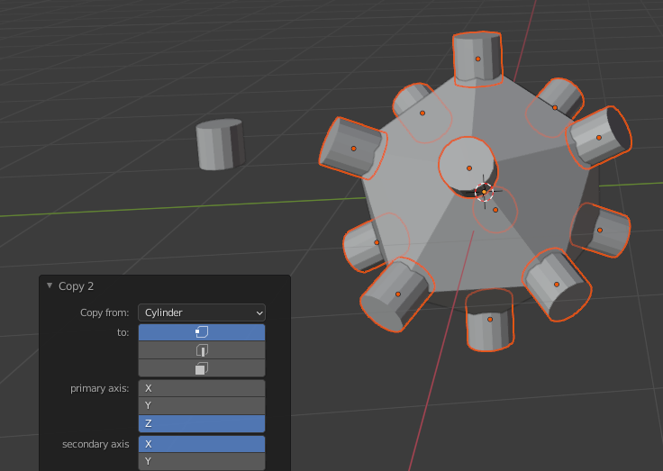
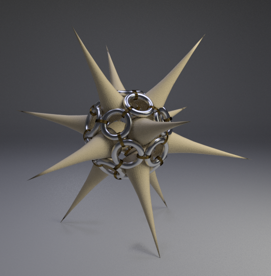
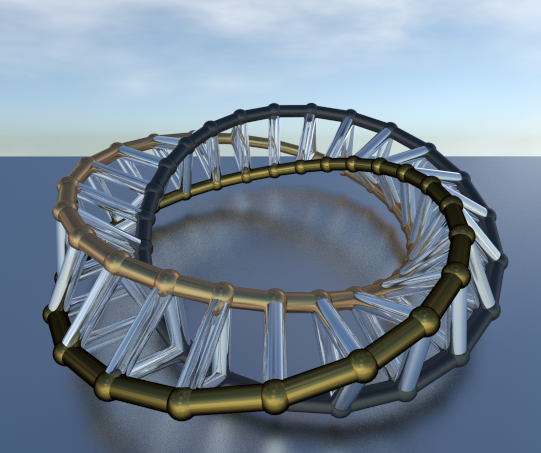
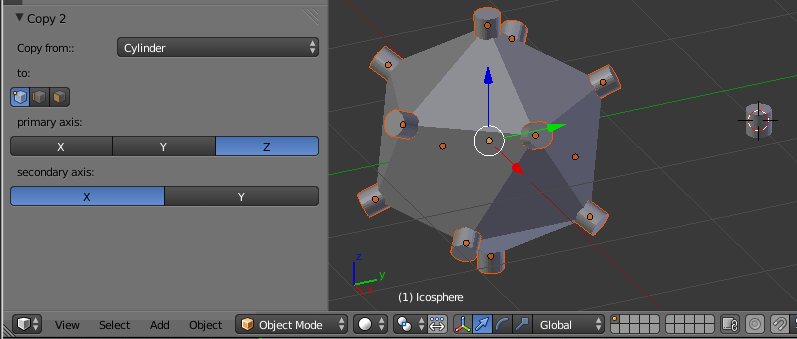

copy2 blender add-on
===================

Updates
copy2.py is for Blender 2.7  
copy2_280.py works for 2.8 through to at least Blender 2.93  

-------

After forgetting about it for a few years I found my old "copy 2" blender python script. (there's an old thread [here](http://blenderartists.org/forum/showthread.php?193616-Copy-object-to-face-edge-or-vertex-script-%28updated-to-2-5-3-1%29)).

I've completely rewritten it into a proper add-on with a panel interface. It now works in Blender 2.71.

The add-on copies an object to either the selected vertices, edges or faces of another object. Here are a couple of examples of the kind of output possible.

To produce this image an icosphere with a single subdivision was used as the destination object. The spike is an edited cone and was copied to the vertices, the silver torus was copied to the faces and the gold rings to the edges of the icosphere. The icosphere was then deleted.

By making use of the random select in edit mode prior to using Copy 2 and the randomize transform afterwards, the add-on can be used to quickly greeble objects.

It can also be used to make ball and stick models of a mesh. Copy a sphere to the vertices and a cylinder to the edges. When copy to an edge is selected, the additional option to scale an object to the edge length is given.

Basic steps
----------

Install the add-on through the User Preferences dialog.

Create a destination object, use `CTRL-A` to apply any scale and rotation to the object.  
In `EDIT` mode select the vertices, edges or faces to which you want to copy the source object.  

Create a source object,  
In `EDIT` mode move the object relative to the object origin. The object origin is the point that is copied onto the mesh.  
In `OBJECT` mode use `CTRL-A` to apply any scale and rotation to the source object.  

Select the destination object, and run the add-on, `Object > Copy 2`.  
A sub panel will appear on the tool panel.  
Choose the source object from the drop down menu.  
Choose by selecting the appropriate icon, whether to copy to the vertices, edges or faces of the destination object.  
Select the primary and secondary axes to determine the orientation of the source object with respect to the normals of the destination object.  

For the vertex option;  
the primary axis is aligned along the vertex normal;  
the secondary axis is aligned to point along one edge of the mesh.

For the edge option;  
the primary axis is aligned along the average of the edge's vertex normals;  
the secondary axis is aligned along the edge.

In edge mode, the option to scale the source object to the length of the edge appears.
One can also change the scale factor.

For the face option;   
the primary axis is aligned along the face normal;  
the secondary axis is aligned to point to one vertex of the face.

Otherwise click the axes alignment buttons until it looks right.

When finished the copied objects are selected, if desired further operators can be applied such as the `Object > Transform > Randomize Transform`.

The copied objects' data are also linked to the source object.  This is useful to make further refinements to the scale or position of the source mesh relative to the source object origin.  If this is not desired they can easily be unlinked. Select them all (select one, then `Select > Linked > Object Data`) then `Object > Make Single User > Object & Data` for one mesh per object.
